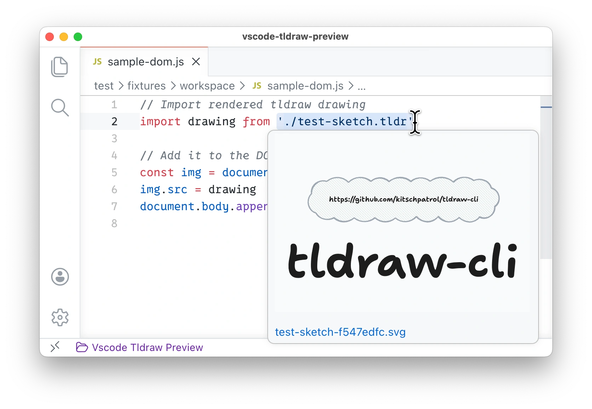

<!-- title ({ titleCase: true, prefix: "VS Code ", postfix: " Extension" }) -->

# VS Code Tldraw Preview Extension

<!-- /title -->

<!-- badges({
  npm: [],
  custom: {
    "Visual Studio Marketplace Version": {
      image: "https://img.shields.io/badge/dynamic/json?url=https%3A%2F%2Fraw.githubusercontent.com%2Fkitschpatrol%2Fvscode-tldraw-preview%2Frefs%2Fheads%2Fmain%2Fpackage.json&query=version&label=VS%20Code%20Marketplace",
      link: "https://marketplace.visualstudio.com/items?itemName=kitschpatrol.tldraw-preview",
    },
  }
}) -->

[](https://opensource.org/licenses/MIT)
[](https://github.com/kitschpatrol/vscode-tldraw-preview/actions/workflows/ci.yml)
[](https://marketplace.visualstudio.com/items?itemName=kitschpatrol.tldraw-preview)

<!-- /badges -->

<!-- short-description -->

**Thumbnail preview images on hover for @kitschpatrol/unplugin-tldraw file paths.**

<!-- /short-description -->

## Getting started

_Let's assume you have [VS Code](https://code.visualstudio.com) installed and are working in a project using the [unplugin-tldraw](https://github.com/kitschpatrol/unplugin-tldraw) build tool plugin to render local tldraw `.tldr` files into SVGs or bitmaps in your build pipeline via [tldraw-cli](https://github.com/kitschpatrol/tldraw-cli)._

Install the extension from the [Marketplace](https://marketplace.visualstudio.com/items?itemName=kitschpatrol.tldraw-preview), or run the following in VS Code's command palette:

```sh
ext install kitschpatrol.tldraw-preview
```

Now, when you hover over a `.tldr` link in your code, you should see a live preview thumbnail of the referenced photo.



For now, this extension does not itself resolve or fetch images; it only provides thumbnail previews for cached Tldraw URLs that have already been resolved by [unplugin-tldraw](https://github.com/kitschpatrol/unplugin-tldraw) via [tldraw-cli](https://github.com/kitschpatrol/tldraw-cli).

This extension is extremely niche and is _not_ a part of the official [tldraw](https://tldraw.dev) project. If you want an extension to actually edit `.tldr` files in VS Code, then you want the [official tldr extension](https://marketplace.visualstudio.com/items?itemName=tldraw-org.tldraw-vscode).

## Configuration

The extension provides the following settings:

| Setting                       | Default                                                | Description                               |
| ----------------------------- | ------------------------------------------------------ | ----------------------------------------- |
| `tldraw-preview.manifestPath` | `node_modules/.cache/tldraw/.tldraw-plugin-cache.json` | Path to the Tldraw cache manifest file    |
| `tldraw-preview.maxWidth`     | `300`                                                  | Maximum width for image previews (points) |

## Supported file types

Hover previews work in the following file types: JavaScript, TypeScript, JSX, TSX, Markdown, MDX, HTML, Astro, and Svelte.

## Maintainers

[kitschpatrol](https://github.com/kitschpatrol)

<!-- contributing -->

## Contributing

[Issues](https://github.com/kitschpatrol/vscode-tldraw-preview/issues) are welcome and appreciated.

Please open an issue to discuss changes before submitting a pull request. Unsolicited PRs (especially AI-generated ones) are unlikely to be merged.

This repository uses [@kitschpatrol/shared-config](https://github.com/kitschpatrol/shared-config) (via its `ksc` CLI) for linting and formatting, plus [MDAT](https://github.com/kitschpatrol/mdat) for readme placeholder expansion.

<!-- /contributing -->

<!-- license -->

## License

[MIT](LICENSE.txt) © [Eric Mika](https://ericmika.com)

<!-- /license -->
